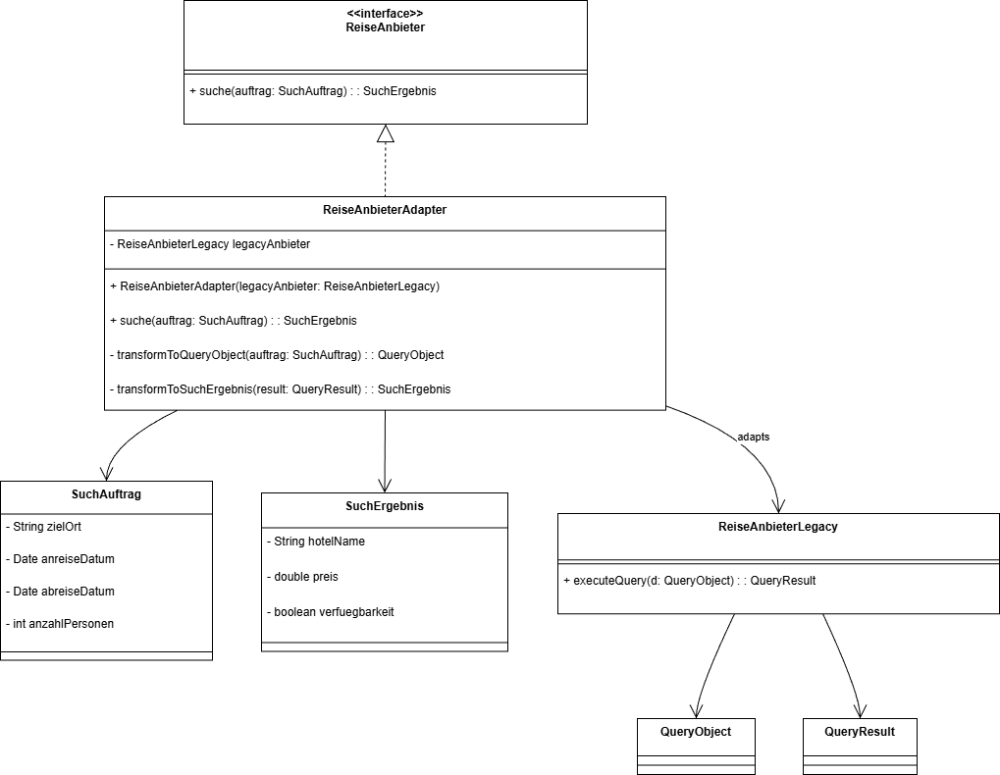
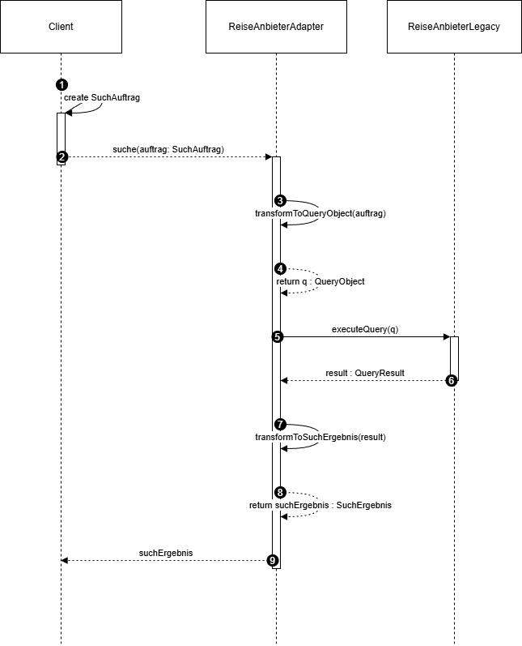
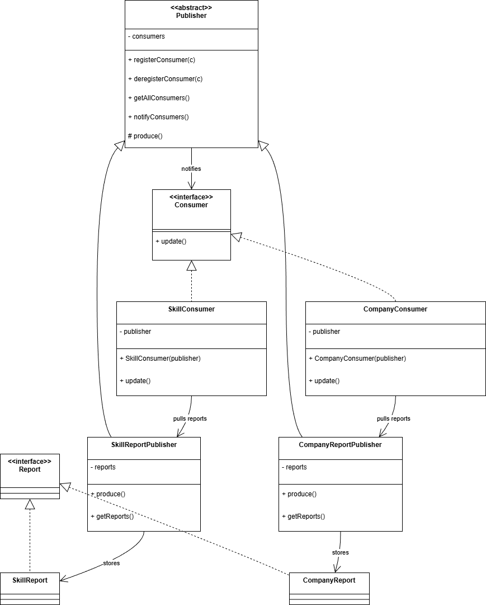

# README – Übungsblatt Nr. 8

---

## Aufgabe 1

### Teilaufgabe a

Für dieses Entwurfsproblem verwenden wir das Adapter-Pattern (Objektadapter), da die Schnittstelle, bzw. die internen Typen „SuchAuftrag“ und „SuchErgebnis“, inkompatibel ist und auch nicht verändert werden darf. 

### Teilaufgabe b
* Siehe Java Code

### Teilaufgabe c

---

## Aufgabe 2

